# Tarea: Mi prompt profesional

## Funcionalidad elegida

La funcionalidad elegida es un CRUD de productos para una tienda utilizando Java Swing.

El programa debe permitir registrar, consultar, modificar y eliminar productos. La clase Producto tendrá los atributos codigo, nombre, precio y stock.

La finalidad es practicar programación orientada a objetos y operaciones CRUD mediante una aplicación de escritorio sencilla.

## Version 1: prompt basico

Crea un programa en Java para gestionar productos de una tienda.

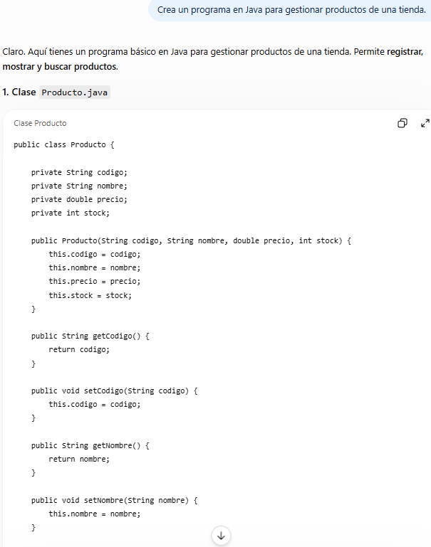
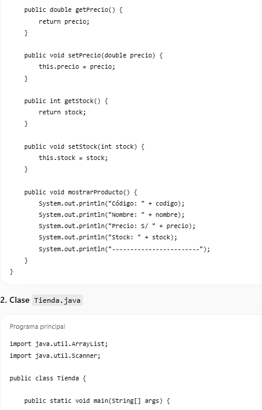
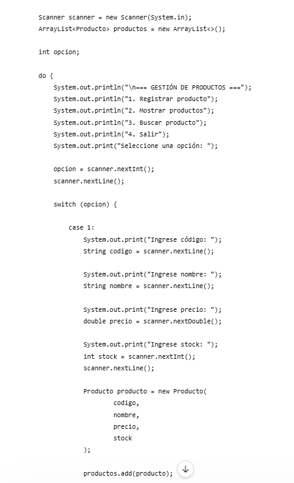
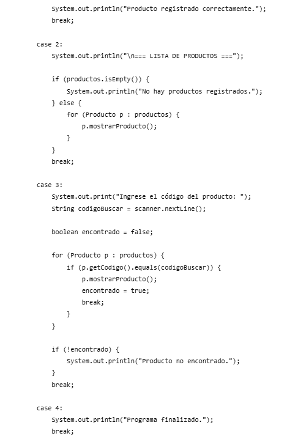
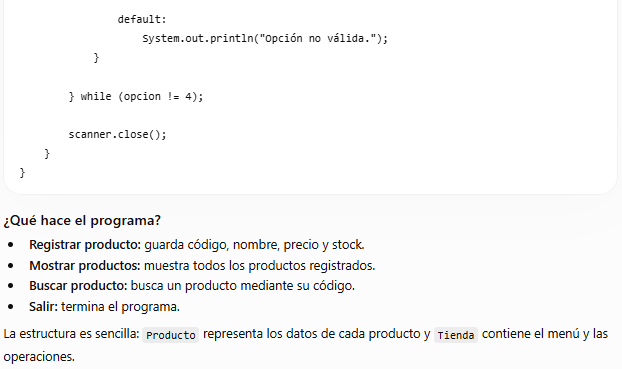

### ¿Qué cambié?

En esta primera versión solamente indiqué de manera general lo que quería desarrollar.

### ¿Por qué?

La intención fue comenzar con un prompt sencillo para observar qué información podía generar la IA sin darle muchos detalles.

### ¿Qué mejoró en la respuesta?

La IA pudo proponer una solución básica, pero la respuesta podía ser diferente a lo que necesitaba porque no se especificaron la tecnología, los atributos, las operaciones CRUD ni el nivel de complejidad.

## Version 2

Actúa como desarrollador Java. Crea un programa para gestionar productos de una tienda usando Java Swing.

La clase Producto debe tener los atributos codigo, nombre, precio y stock.

El programa debe permitir registrar, consultar, modificar y eliminar productos.

Explica brevemente la estructura y muestra el código Java.

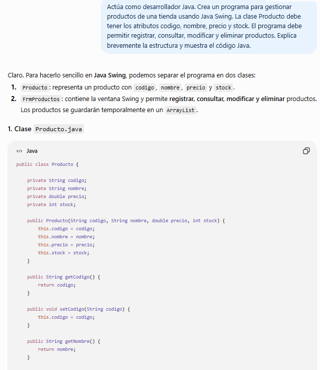
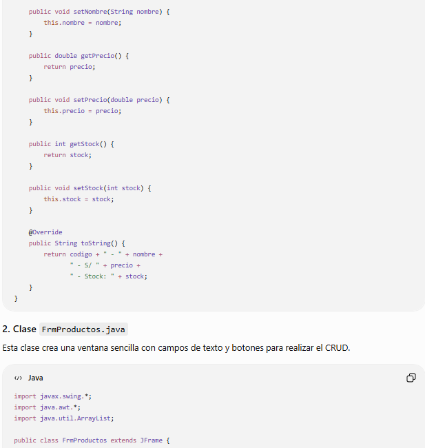
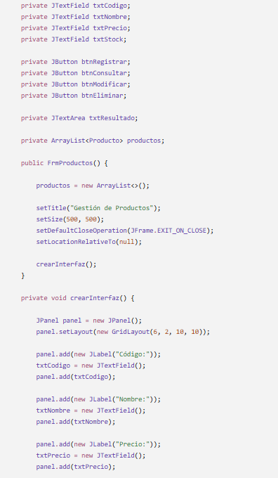
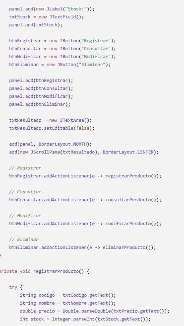
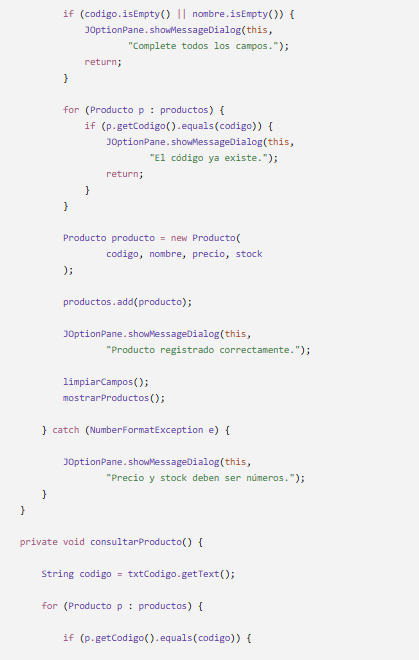
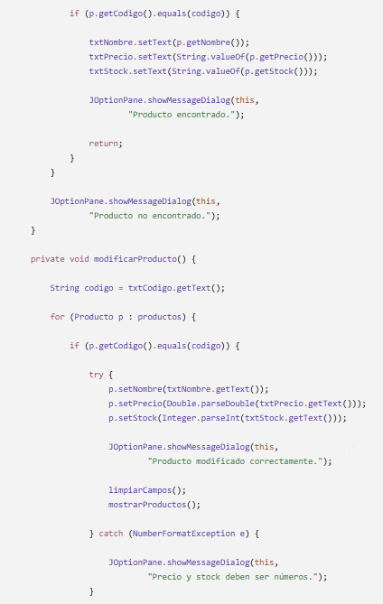
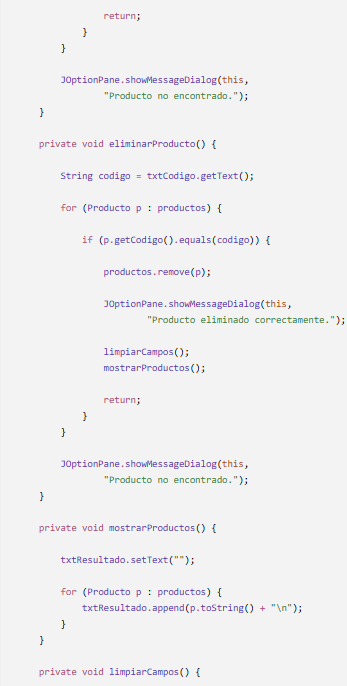
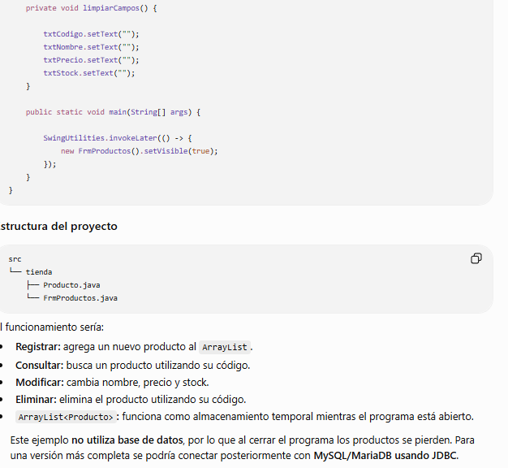

### ¿Qué cambié?

Agregué el rol de desarrollador Java, la tecnología Java Swing, los atributos de la clase Producto y las operaciones CRUD.

### ¿Por qué?

Estos datos permiten que la IA conozca mejor qué tipo de aplicación necesito y qué funcionalidades debe implementar.

### ¿Qué mejoró en la respuesta?

La respuesta fue más específica y estuvo más relacionada con el programa que necesitaba desarrollar. Sin embargo, todavía faltaba indicar el nivel del estudiante, restricciones, ejemplos y el formato exacto de la respuesta.

## Version 3: prompt final

Actúa como desarrollador Java con experiencia en aplicaciones de escritorio usando Java Swing.

Crea una solución sencilla para gestionar productos de una tienda mediante un CRUD. Debe permitir registrar, consultar, modificar y eliminar productos. Usa una clase Producto con los atributos codigo, nombre, precio y stock, utilizando métodos como getPrecio() y setPrecio(double precio).

La aplicación será desarrollada por un estudiante que está aprendiendo Java. La interfaz debe ser sencilla y fácil de comprender. El proyecto se ejecutará como una aplicación de escritorio con Java Swing. El objetivo es practicar programación orientada a objetos y operaciones CRUD.

Ejemplo de un producto:

codigo: P001

nombre: Teclado

precio: 80.50

stock: 10

Ejemplo de método:

public double getPrecio() {
    return precio;
}

public void setPrecio(double precio) {
    this.precio = precio;
}

Presenta primero una explicación breve de la clase Producto. Después muestra el código completo de la clase Producto y finalmente muestra un ejemplo sencillo de cómo registrar y consultar productos desde Java Swing. Usa nombres de variables claros y código básico.

No uses librerías externas. Utiliza solamente Java y Java Swing. No agregues funcionalidades que no hayan sido solicitadas y mantén el código sencillo para un estudiante.

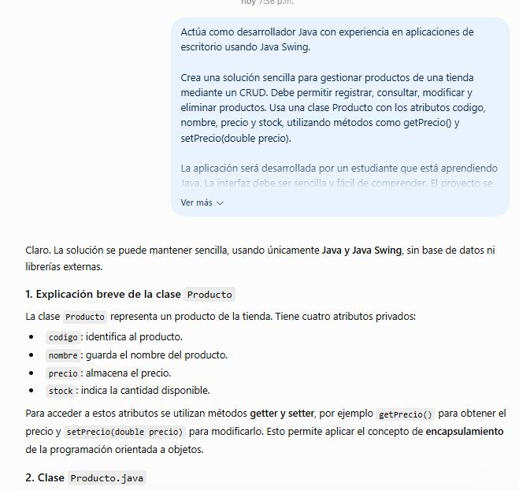
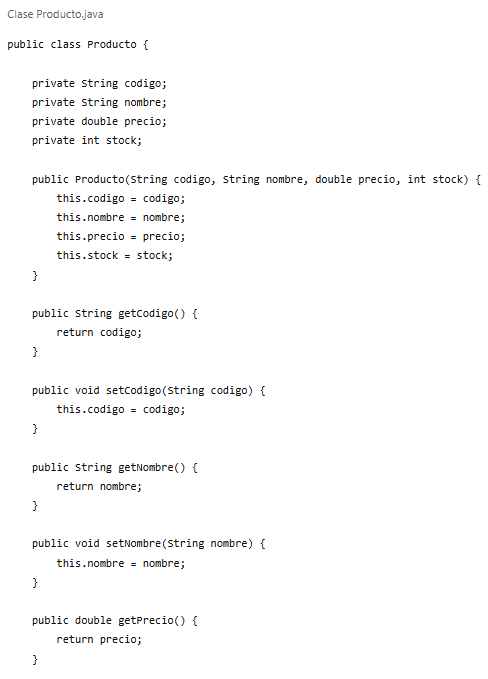
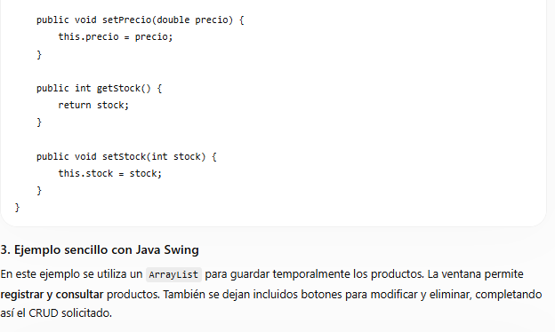
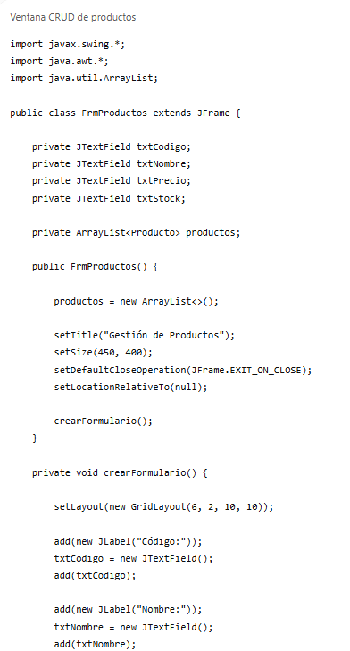
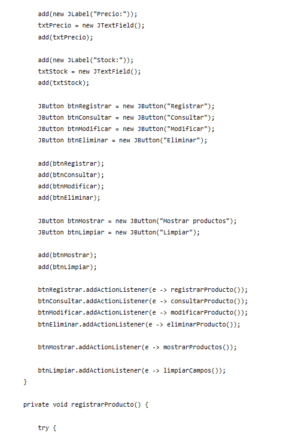
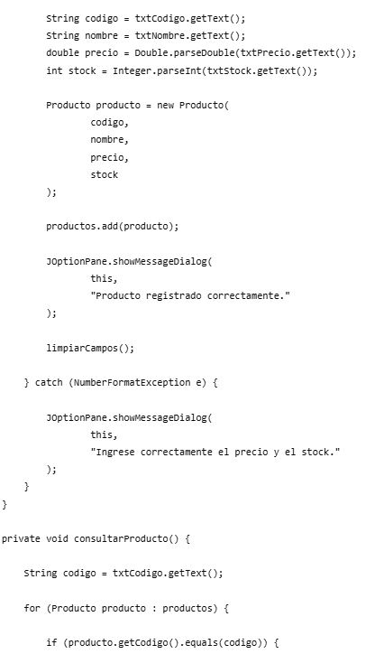
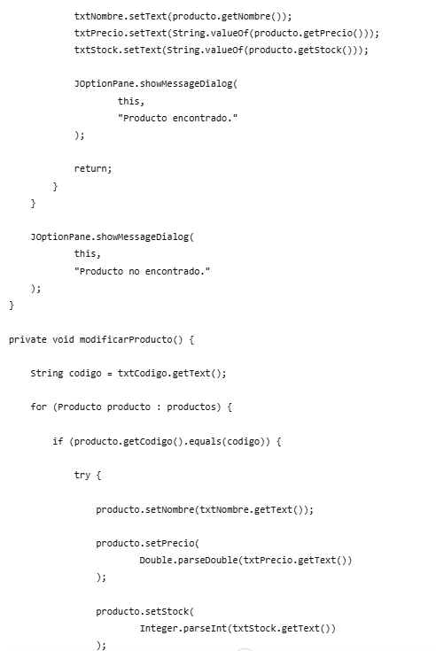
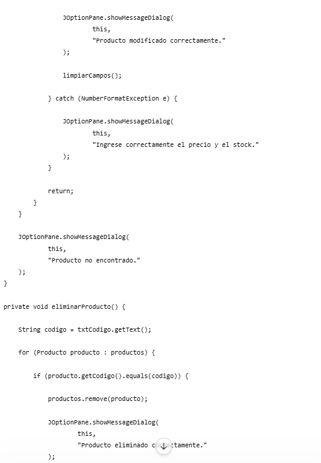
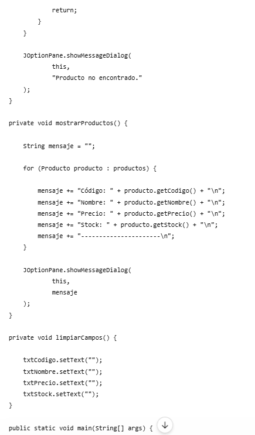
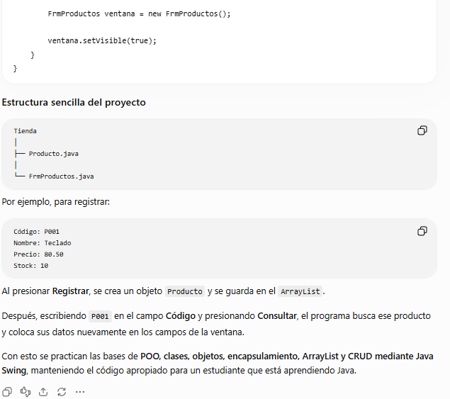

### ¿Qué cambié?

En la tercera versión agregué todos los elementos necesarios para que el prompt fuera más profesional. Especificqué el rol, la instrucción, el contexto del proyecto, ejemplos y el formato esperado de la respuesta.

También agregué una restricción para indicar que no se deben utilizar librerías externas.

### ¿Por qué?

Quise evitar respuestas demasiado generales y conseguir una solución adaptada a un estudiante que está aprendiendo Java.

### ¿Qué mejoró en la respuesta?

La respuesta final fue más precisa y organizada. La IA pudo generar una solución utilizando Java Swing, con la clase Producto, los métodos get y set, las operaciones CRUD y una explicación sencilla.

## Componentes del prompt final

| Componente | Identificación en el prompt |
|---|---|
| Rol | Actúa como desarrollador Java con experiencia en aplicaciones de escritorio usando Java Swing. |
| Instrucción | Crea una solución sencilla para gestionar productos de una tienda mediante un CRUD. |
| Contexto | La aplicación será desarrollada por un estudiante que está aprendiendo Java. |
| Ejemplos | Producto P001 y los métodos getPrecio() y setPrecio(). |
| Formato | Presenta primero una explicación, después el código y finalmente un ejemplo sencillo. |
| Restricción | No uses librerías externas. Utiliza solamente Java y Java Swing. |

## Evaluación del resultado

| Criterio | Resultado |
|---|---|
| Utiliza Java Swing | Sí |
| Contiene la clase Producto | Sí |
| Tiene los atributos solicitados | Sí |
| Permite operaciones CRUD | Sí |
| Utiliza métodos get y set | Sí |
| Usa librerías externas | No |

## Errores que evité

### 1. Ser demasiado general

En la versión 1 el prompt era demasiado general:

Crea un programa en Java para gestionar productos de una tienda.

Para evitar este problema, en las siguientes versiones especificamos Java Swing, los atributos de Producto y las operaciones CRUD.

### 2. No indicar el formato

También se podía obtener una respuesta con una estructura diferente a la esperada.

Para evitarlo, en la versión final se indicó claramente que primero debía aparecer una explicación de la clase Producto, después el código completo y finalmente un ejemplo sencillo utilizando Java Swing.

## Observaciones

La versión final del prompt presenta información más clara y específica que la primera versión. La iteración permitió mejorar el contexto, los ejemplos y el formato de la respuesta.

## Conclusiones

1. Un prompt con información específica permite obtener respuestas más relacionadas con la necesidad planteada.

2. Agregar contexto, ejemplos y restricciones ayuda a orientar mejor la respuesta de la IA.

3. La iteración de los prompts permitió pasar de una solicitud general a una instrucción más completa y organizada.

4. El uso de Java Swing y la clase Producto quedó claramente definido en el prompt final.